# Construindo um Tela de Jogo

Acesso ao Site para poder rodar.

http://editor.construct.net/

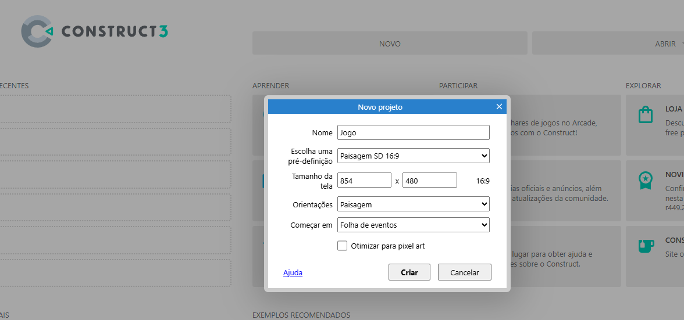

Depois de inserir com duplica clique, selecionar o Sprite, e colocar o nome

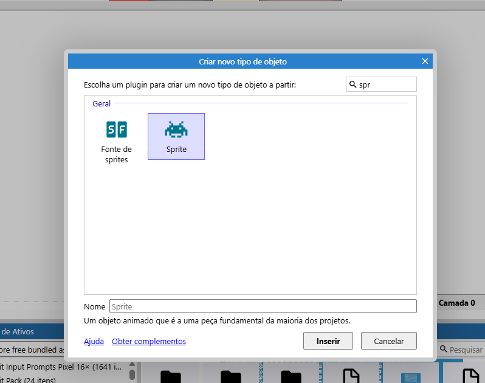

Clique na pasta, selecione a pasta e pegue a imagem.
Control e scroll ele aumenta ou dimínui, e o recorta ele seleciona e corta o padrão da imagem.

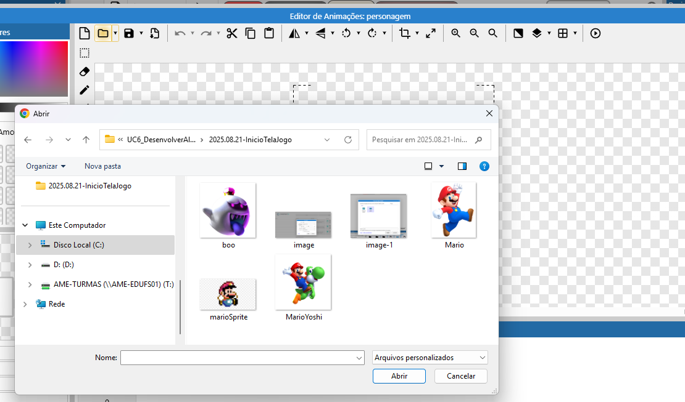

Depois de inserir, Fechar.

Para dar movimento, seleciona o prsonagem, vai em Comportamentos, Adicionar / Editar

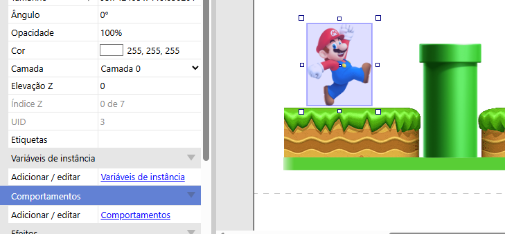

Seleciona Plataforma

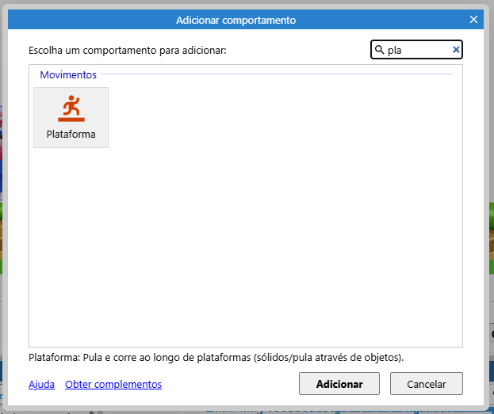

Nas propriedaes, Plataforma, desmarcar a opção "Controle Padrão", isso faz com que a imagem caia

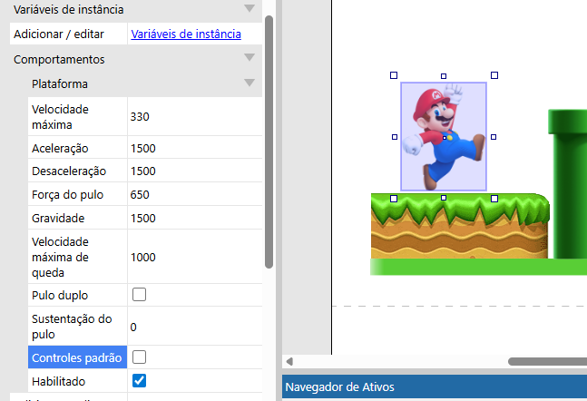

Para colocar um comportamento para pode parar, adiconar o comportamento Solido. Para quando ele bater para.

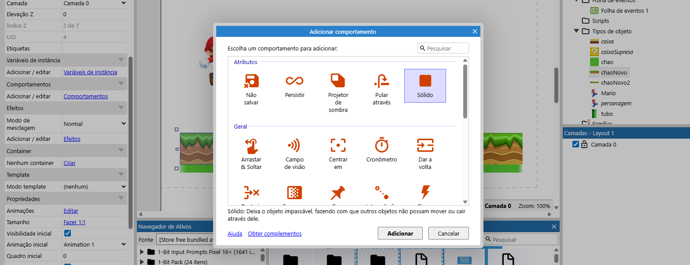

Para dar movimento, na barra direita, clicar com botão direito, e adcionar movimento

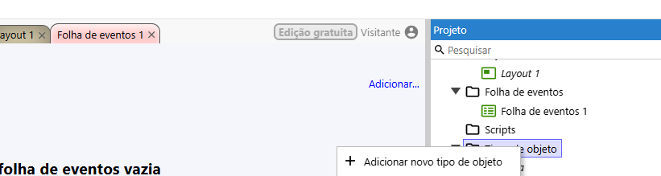

Adiciona o movimento Teclado

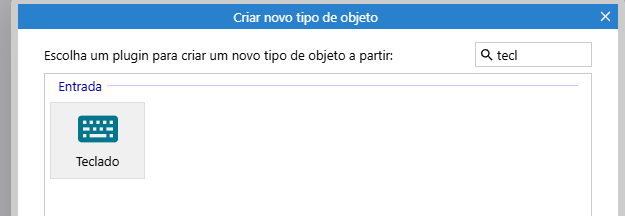

Adicionar Evento, seleciona tecaldo

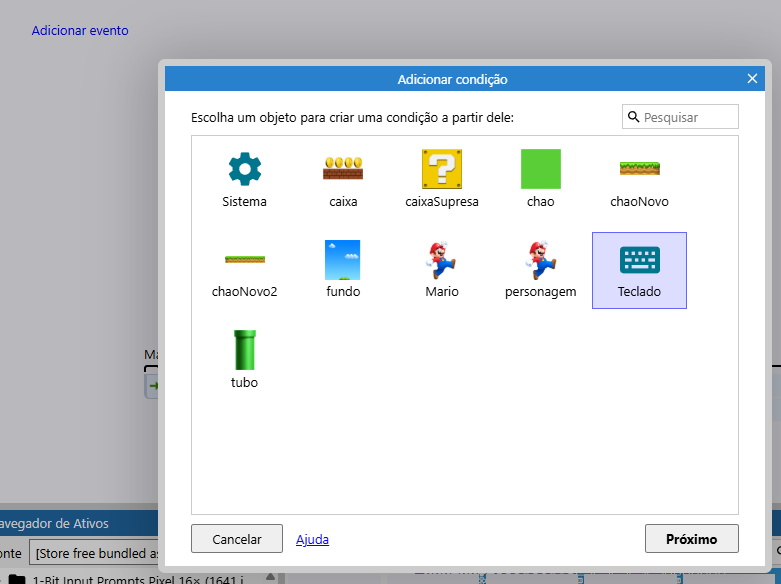

Selciona Precionar Tecla

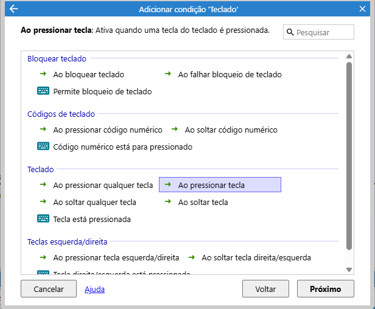

Selcione a Letra no caso D

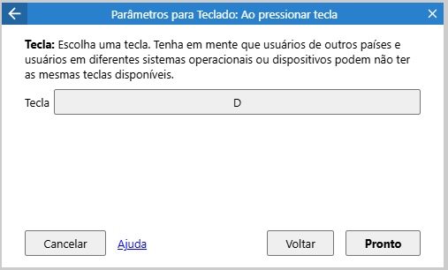

Adicionar o Evento, no personagem

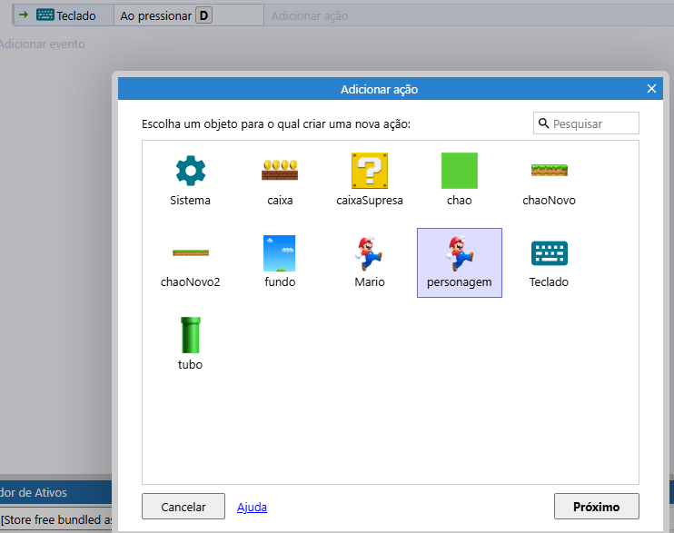

Selcione, o tipo do evento, para ele ir para a direita

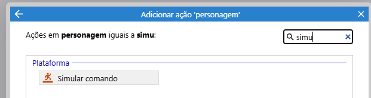

Adiciona os Eventros para poder rodar

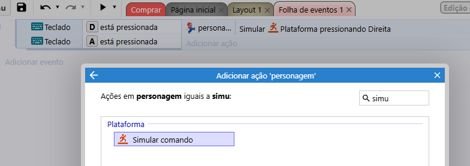

Selcione um espelhado para poder inverter o Mario

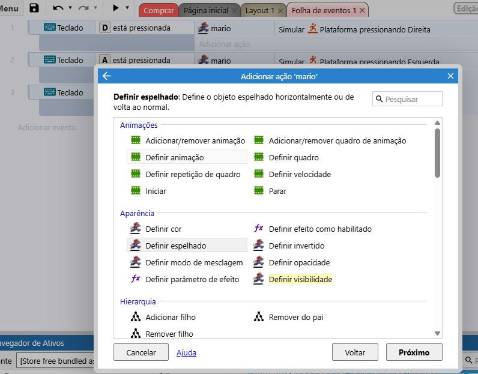

Final da programação

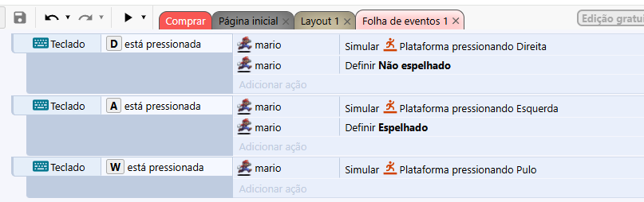