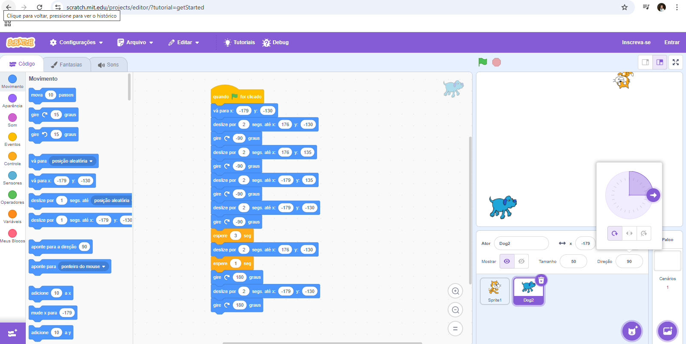
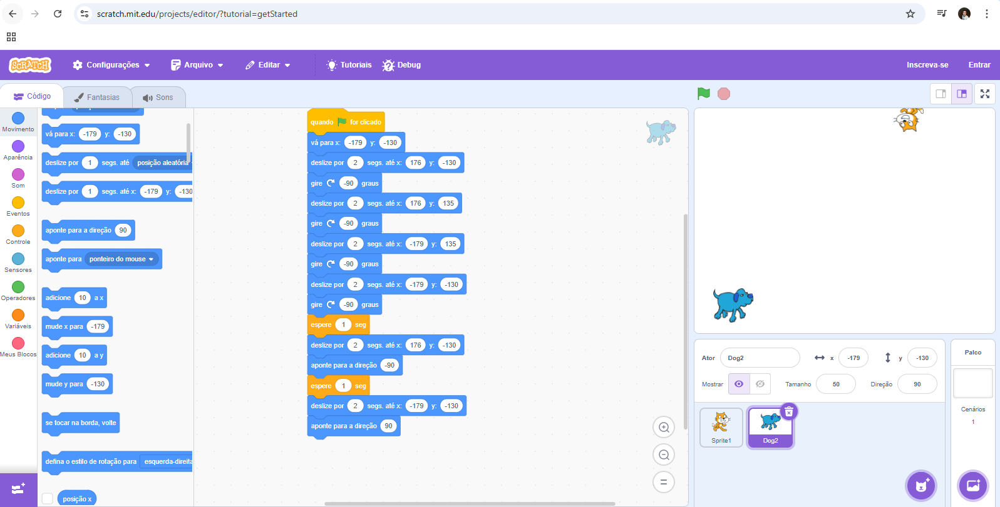
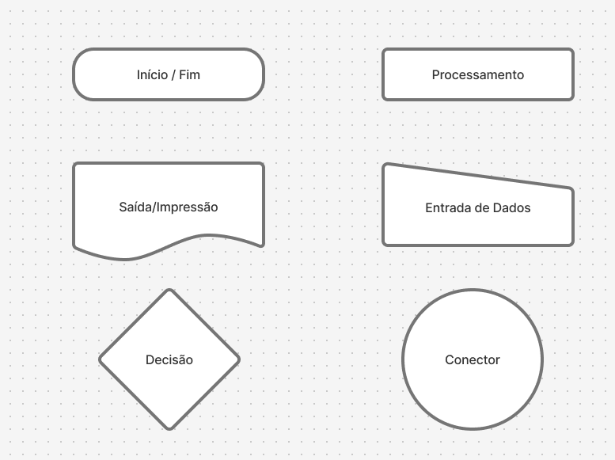

# UC6_DesenvolverAlgoritmos

✅ O que é um Algoritmo?

Um algoritmo é uma sequência de passos lógicos e bem definidos que servem para resolver um problema ou realizar uma tarefa.

📌 Conceitos Importantes

## Finito
Um algoritmo deve ter fim. Isso significa que ele não pode rodar para sempre — em algum momento ele precisa parar, depois de executar os passos necessários.

Exemplo: Uma receita de bolo tem um fim — quando o bolo está pronto.

## Claro (ou definido)
Cada passo do algoritmo deve ser claro e sem ambiguidade. Qualquer pessoa ou computador que seguir os passos deve entender exatamente o que fazer.

Exemplo ruim: “Misture os ingredientes até ficar bom.” → Isso é vago.
Exemplo bom: “Misture por 5 minutos com uma colher.”

## Resolve um problema
O algoritmo tem um objetivo: ele serve para resolver um problema específico.

Exemplo: Um algoritmo que ordena uma lista de números do menor para o maior.

🧠 Exemplo simples de Algoritmo (problema: somar dois números)

Problema: Somar dois números e mostrar o resultado.

Algoritmo:

Leia o primeiro número.

Leia o segundo número.

Some os dois números.

Mostre o resultado.

➡️ Esse algoritmo é finito, claro e resolve um problema.

## Site para treino de Algoritmo.

https://studio.code.org/courses/frozen/units/1/lessons/1/levels/1
 
https://studio.code.org/hoc/1
 
https://scratch.mit.edu/projects/editor/?tutorial=getStarted

## Simbolos para poder mostrar as decisões;

