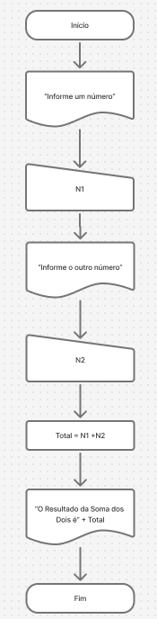

# UC6_DesenvolverAlgoritmos
UC6: Desenvolver algoritmos

Fazer o Fluxo Grama e o Pseudocódigo

https://portugol.dev/


https://www.figma.com/board/00yJYu72PUTqYqCIGqRWNy/Sem-t%C3%ADtulo?node-id=0-1&p=f&t=eABWD48DFv22q599-0

## Exemplo de como fazer 

Um psidocodigo de como fazer.

```
programa {
  funcao inicio() {
    inteiro n1 = 0, n2 = 0, total = 0
    escreva("Informe um número: ")
    leia(n1)
    escreva("Informe outro número: ")
    leia(n2)
    total = n1 + n2
    escreva("O Resultado da Soma dos Dois é: " + total)
  }
}
```

Um fluxo grama.

