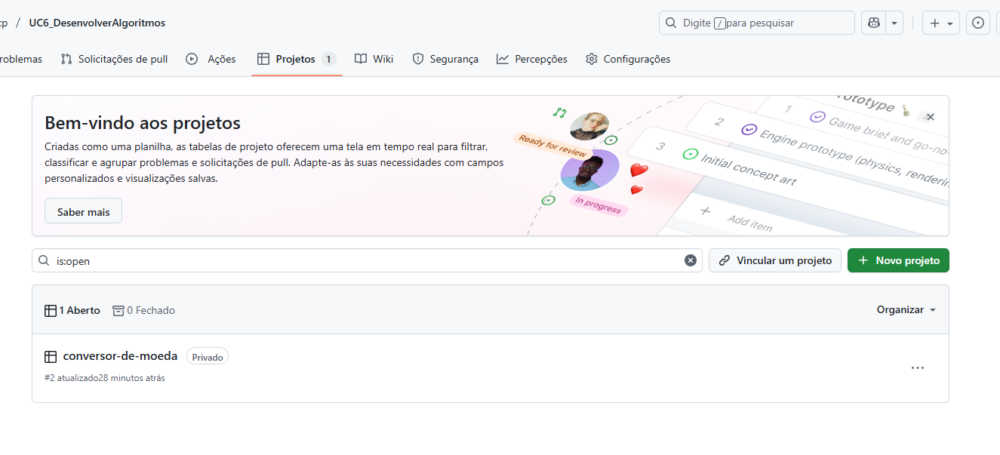
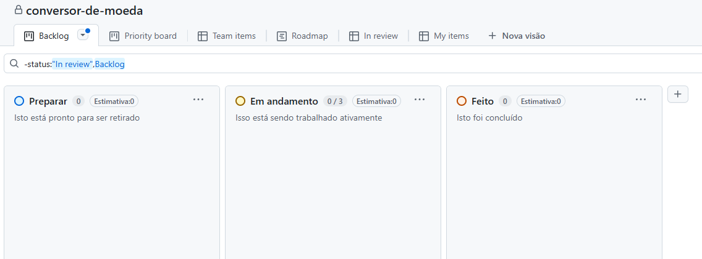

# Kanban

Usado para poder fazer o controle da equipa para realização de projeto.

- Usado no Gih mesmo, abrir o repositório ir em Projetos, e adicionar Novo Projeto.

- Usando no para controlar o desenvolvimento do projeto.

- Para convidar usuário, tem que convidar pelo repositorio e projeto