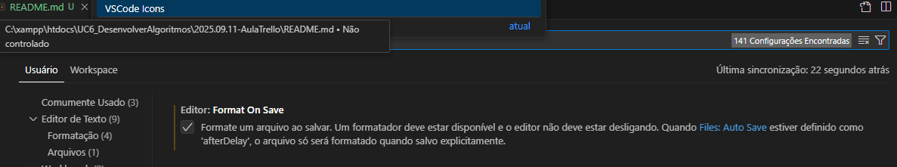

# Aulo da trello.

Acessa o site da trello, acesso pelo email emerdcp@gmail.com

Link para consulta de JavaScript

https://developer.mozilla.org/pt-BR/docs/Web/JavaScript
https://www.alura.com.br/artigos/javascript

## Formação do VSCode.

Para colocar indexação das linhas.


## Plugins

Instalar.

- Portuguese Brasil
- Live Sever
- VsCode Icons
- Error lens
- MySql
- node.js

## Java

Para conseguir ver o que está dentro do campo.

```
console.log("Olá Mundo!")
console.log(5*9)
```


